<h1 align="center">👋 Hey, I'm Hyago</h1>

  <strong>Full-stack Developer</strong> · Backend · Cloud · DevOps

  Building scalable applications and exploring distributed systems.

  
  

---

## 🚀 Projects

<table>
<tr>
<td width="50%">

### 🎥 Concord

Real-time communication platform inspired by Discord.

**Focus**

`WebRTC` `WebSockets` `Real-time` `Scalability`

**Stack**

`TypeScript` · `NestJS` · `React`

</td>

<td width="50%">

### 🏨 Hotel Management

Modular monolith focused on consistency and concurrency.

**Highlights**

`Row-level Locking` `Multi-tenancy` `Transactions`

**Stack**

`NestJS` · `Prisma` · `PostgreSQL`

</td>
</tr>

<tr>
<td width="50%">

### 🤝 Job Matching

Semantic matching platform connecting candidates and opportunities.

**Focus**

`RAG` `pgvector` `Async Processing`

**Stack**

`NestJS` · `TypeORM` · `RabbitMQ`

</td>

<td width="50%">

### ⚙️ Currently Exploring

`Distributed Systems`

`Cloud Native`

`WebRTC`

`Kubernetes`

</td>
</tr>
</table>

---

## 🛠️ Tech Stack

### Languages

  

### Frontend

  

### Backend

  

### Databases & Messaging

  

### Cloud & DevOps

  

---

## 📊 GitHub Stats

  

  

  

---

## 🎓 About

  🎓 Information Systems @ Unifacisa
  &nbsp;&nbsp;•&nbsp;&nbsp;
  💻 Full-stack Developer
  &nbsp;&nbsp;•&nbsp;&nbsp;
  🇧🇷 Campina Grande, PB

  <i>Code by day. Train by night. 🏋️</i>

